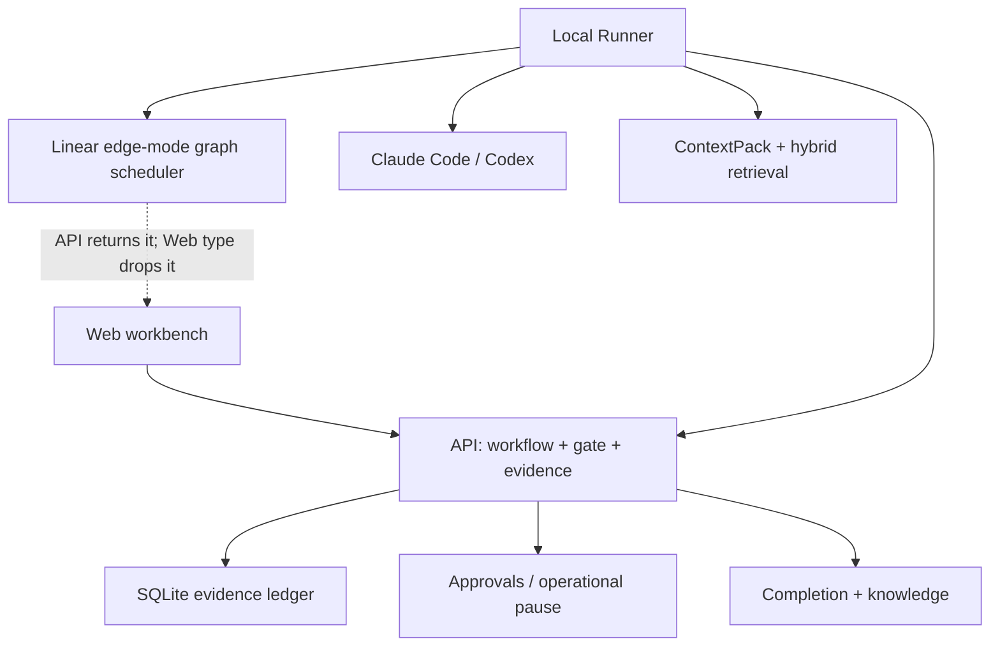

# AI Native Platform 现状研究

- Benchmark: local repo @ `21b8539646af2eec3d43a296eec48a735b272631`
- Date: 2026-07-31
- Confidence: high for cited runtime and Web contracts

## 速答

AINP 是多项目 AI 软件交付工作台，不是终端里的 coding-agent host。它已经拥有不少初稿误判为“缺口”的能力：

1. Durable graph/node/event ledger、线性 flow 调度、edge-mode scheduler 和 checkpoint manual resume；更丰富的 retry/resume/failure/join policy 目前主要还是声明面。
2. 强类型 AC 验收矩阵、ID reconciliation 和 scenario gate；逐 AC 的执行证据映射仍需硬化。
3. 真实落地的 BM25 + embedding hybrid 代码检索及降级路径。
4. 新进程 cold review、真实 HandoffRecord、operational pause、人工审批和 Completion Report。
5. ContextPack 的 trust/freshness/sourceRefs/budget/governance 比 UMADEV 的普通 prompt 固件更平台化。

真正的缺口集中在“已有底座没有进入操作面”和“执行边界没有硬化”：Web 丢弃 API 已返回的 Graph 数据；review 仍是自由 Markdown 且可写 workspace；Graph 默认只是线性 stage adapter；Gate 的 rule message 没在关键决策面完整展示；证据持久化的 redaction/bounded I/O 尚未统一。

## 已有能力，不能重复建设

### 1. Graph ledger 已经驱动线性 flow，但 policy runtime 尚未闭环

- `packages/shared/src/types/graph-runtime.ts:17-110`：声明 node/run/edge/join/resume/failure/retry 类型。
- `apps/runner/src/orchestrator.ts:241-319`：Runner 按 graph 计算 runnable node 并记录 attempt。
- `apps/runner/src/orchestrator/graph-scheduler.ts:117-140`：生产 scheduler 当前只执行 `edge.mode`；没有消费 node retry/join/failure/resume policy。
- `apps/api/src/routes/workflow-runs.ts:155-192`：run detail 已返回 `graph`。
- `packages/shared/src/flows/graph-adapter.ts:16-76`：当前默认图由 flow 生成，仍是线性 stage 图。
- `apps/api/src/routes/runner-events.ts:320-326`：node fail 会把 GraphRun 设为 failed，但成功路径没有收敛为 passed。
- 结论：不用从零建 graph ledger；缺的是 policy enforcement、aggregate status convergence、run-specific authoring 和 Web projection。

### 2. Acceptance coverage 的 typed substrate 已有，criterion proof 仍偏启发式

- `packages/shared/src/types/artifact.ts:304-336`：`VerifierAcMatrix` 的 AC、scenario、business status、risk、evidence。
- `apps/runner/src/orchestrator/steps.ts:690-775`：Runner 生成 verifier matrix。
- `apps/api/src/gate-engine.ts:647-821`：Gate 做 AC 对账和 core/boundary/exception 覆盖。
- `apps/web/src/page-task-detail.ts:1860-1997`：UI 展示验证方法、证据与风险。
- `apps/runner/src/orchestrator/steps.ts:815-842`：非 UI AC 的 pass 与 evidence 绑定仍由文本/通用 artifact 启发式生成。
- `apps/api/src/gate-engine.ts:1457-1478`：`proven` 主要检查 evidence refs 非空和 verificationMethod 非 command-only。
- 结论：不应重建 coverage 子系统；应补 criterion-specific execution proof，并可另加 OpenAPI/项目 contract gate。

### 3. Hybrid 代码检索已经落地

- `apps/runner/src/source-chunk-embedding.ts:93-110`：外部 embedding provider 失败后回退本地确定性向量。
- `apps/api/src/store/store.ts:954-1110`：BM25 + cosine 组合排序。
- `apps/runner/src/orchestrator/invoke-skill.ts:663-721`：每次 skill invocation 实际查询 source catalog。
- 结论：未来可提升真实本地语义质量和知识召回，但不应重建 code retrieval 管线。

### 4. Cold review 与 Handoff 已有真实路径

- `apps/runner/src/agents/claude-code.ts:190-205`：Claude 使用 `--no-session-persistence`。
- `apps/runner/src/agents/codex.ts:149-168`：Codex 使用 `exec --ephemeral`。
- `apps/runner/src/orchestrator/steps.ts:554-586`：executor -> reviewer 是真实 child AgentSession handoff。
- `apps/runner/src/orchestrator/steps.ts:589-687`：build failure 会生成 debugger handoff record/analysis skeleton，但没有调用 debugger backend。
- `apps/runner/src/orchestrator/stage-handoff.ts:14-38`：stage handoff 含 summary/decisions/risks/openQuestions。
- 结论：缺统一 review verdict 和可验证写隔离，不缺 handoff 骨架。

### 5. Operational failure 已与业务失败分离

- `packages/shared/src/utils/operational-error.ts:2-24`：typed operational failure。
- `apps/api/src/workflow-engine.ts:570-633`：run/request 进入 paused 并保留恢复边界。
- `apps/web/src/page-task-detail.ts:2756-2824`：UI 显示暂停原因和恢复动作。
- 结论：UMADEV 的 review unavailable 可直接映射到现有 pause 语义，无需新建另一种生命周期。

### 6. Gate 与上下文治理是 AINP 的平台优势

- `packages/shared/src/types/gate.ts:24-49`：`RuleResult` 已有 status/message/evidence，Agent 不能决定 gate 状态。
- `packages/shared/src/types/context.ts:20-171`：ContextPack 含 manifest、trust、freshness、budget、retrieval hints、calibration signals。
- `apps/runner/src/context/renderer.ts:142,389`：仓库和生成 artifact 明确按 evidence 而非 instruction 注入。
- 结论：借鉴 UMADEV 时必须复用 GateRun、EvidenceRef、ContextPack 和 operational pause，不能另起平行体系。

## 真实缺口

### 1. Web 没有消费 Graph Runtime

- API detail 返回 `graph`，但 `apps/web/src/projection.ts:392-408` 的 `RunDetail` 没有该字段。
- 当前用户只看到 stage timeline，无法看到 node attempt、dependency、resume cursor 或 graph event。
- 最小落点：先修 GraphRun aggregate status 或从 node runs 派生可靠状态，再补 shared DTO + projection 做只读渲染。

### 2. Graph 的声明能力远大于当前生产语义

- `graph-adapter.ts:21-39` 把 `inputSelectors/outputNames` 留空，`maxAttempts=1`，`failurePolicy=fail_fast`，`joinPolicy=none`。
- edge 默认全部线性 `all_success`；生产 scheduler 只执行 edge mode，尚不 enforce retry/join/failure/resume policy。
- GraphRun 成功完成后不会自动转为 `passed`，Web 不能直接把它当完整 aggregate truth。
- 最小落点：先修 aggregate status 或从 node runs 派生可靠读模型，再把 node evidence/output contract 填实；之后才考虑 branch/join 和 auto-rework。

### 3. Review verdict 仍是自由文本

- `apps/runner/src/skills/index.ts:280-294`：review 只要求 `review.md`。
- `packages/shared/src/types/agent.ts:80-88`：AgentResult 只有 status/summary/output ids。
- `apps/api/src/gate-engine.ts:1282-1285`：非 verifier 的 `other` artifact 基本都可能被当作 review，识别过宽。
- 最小落点：增加严格 schema 的 reviewer verdict，复用 EvidenceRef，并把 unavailable 映射到 operational pause。

### 4. Cold 已有，但单写者还不是硬不变量

- `skill.review` 声明 `writableGlobs=[]`，但它只是策略元数据。
- Codex 所有 stage 使用 `workspace-write`（`codex.ts:149-168`）。
- Claude review 仍允许 `Write`（`claude-code.ts:419-430`），因为需要写输出 artifact。
- 最小落点：review 前后 workspace fingerprint/diff 守卫；进一步将 reviewer 输出改为受控 sidecar/last-message 通道，按 backend capability 选择只读执行面。

### 5. Gate 的行动信息没有进入关键决策面

- `RuleResult.message` 已存在，但 `renderRuleList()` 只显示 label/status（`page-task-detail.ts:1617-1637`）。
- 失败侧栏也只拼规则名称（`page-task-detail.ts:2827-2895`）。
- 最小落点：先直接展示现有 message/evidence，再引入 optional remediation；这比先造复杂团队面收益更快。

### 6. 自动返工只有类型基础，没有闭环

- Graph 有 retry/attempt，StepCheckpoint 有 resume cursor，Web 有 manual retry。
- `apps/runner/src/orchestrator.ts:452-457` 明确没有自动 retry loop。
- 修复通常需要 implementation -> build_test -> review 的受控小图，不是简单重跑失败命令。
- 最小落点：先让手动 repair 消费 typed remediation，再只对 deterministic compile/test blocker 开有界循环。

### 7. Artifact freshness 没有形成 run 内失效传播

- AINP 已有 artifact sha256、ContextPack sourceRefs、Handoff producedArtifacts 和 knowledge freshness。
- `retryStage()` 主要重置目标 stage/run 状态（`workflow-engine.ts:623-677`），没有统一的“上游 digest 变化 -> downstream evidence stale”协议。
- 最小落点：记录 node 实际消费的 artifact digest；上游变化时重开所有消费者，而不是只依赖“取最新 kind”。

### 8. 持久化安全边界未统一

- stream/preflight 会 `maskSecrets`，但 command stdout/stderr、git diff、部分 report/artifact 直接写盘。
- `apps/runner/src/command-runner.ts:123-129` 写原始命令输出。
- `apps/runner/src/agents/cli-common.ts:130-151` 写原始 diff。
- `apps/api/src/artifact-content.ts:31-41` 做 root realpath 检查后无大小上限地读取，且校验/读取分步存在 TOCTOU 面。
- 最小落点：集中 persistence helper，明确 bounded read、no-follow/identity check、atomic write 和 redacted view；不要让不同 artifact 各自实现。

### 9. Backend 只有“run”，没有 capability contract

- `apps/runner/src/agents/types.ts:41-50` 只暴露 `kind` 和 `run()`。
- resume、fork/cold、plan events、interactive question、permission surface、exact usage 等能力无法被调度器显式判断。
- 最小落点：先定义 capability snapshot 并持久化到 AgentSession，不急着扩到五个 backend。

## AINP 已有且应保留的优势

1. Web/API/Runner 分层和多项目证据浏览，不退回单仓 TUI。
2. 人工审批、operational pause、Completion Report、knowledge candidate。
3. Gate Engine 决定状态，Agent 只提供证据/意见。
4. 强类型 Verifier AC matrix 和真实 command/test evidence。
5. ContextPack 的 sourceRefs/trust/freshness/budget/governance。
6. Graph Runtime、StepCheckpoint 和 durable API ledger。

## 限定

- “WorkflowEngine 唯一写者”只应限定为核心 WorkflowRun/StepRun 生命周期迁移；Graph ledger 由 runner-event route 写，GateRun 由 GateEngine 写。
- 当前是本地可信模式，持久化安全加固的优先级取决于是否扩大到不受信仓库、多用户或远程 Runner。
