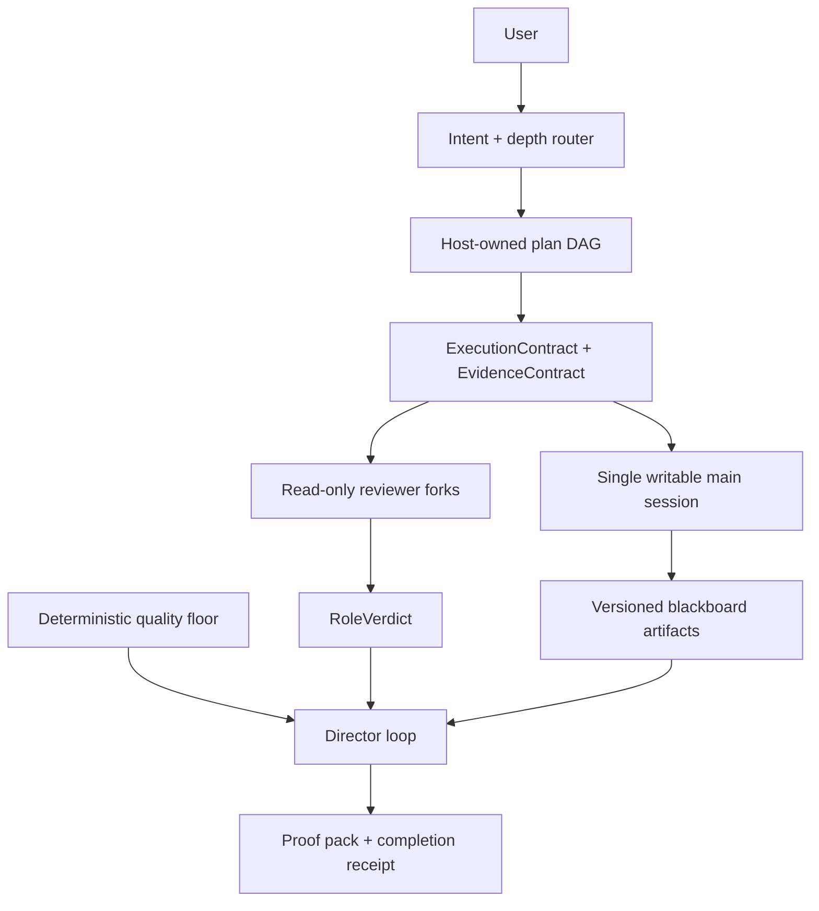

# UMADEV 架构研究

- Benchmark: https://github.com/umacloud/umadev @ `b7484379db8ef7fa1881c84e7e9252c85c60061c` (`v1.0.71`)
- Date: 2026-07-31
- Type: module-overview / spike
- Confidence: high for the cited runtime contracts; medium for end-to-end product behavior because UMADEV was not run interactively

## 速答

UMADEV 是一个 Rust 单二进制 coding-agent host。它不持有模型 API，而是适配 Claude Code、Codex、OpenCode、Grok Build、Kimi Code 五个底座。最值得 AINP 借鉴的不是 TUI 或 Rust 形态，而是它把一次 Agent 执行变成了可验证的运行协议：

1. Host 持有可恢复的依赖 DAG，每个 mutating step 都可附具体的执行范围和证据契约。
2. 写者串行并受独占运行锁约束；评审从写者执行面分离。
3. 评审使用统一 `RoleVerdict`，区分 `pass / fail / unavailable`，并携带 blocker、remediation、evidence、provenance。
4. 确定性地板是完成的必要条件，模型 `pass` 不能单独放行；同时，required reviewer 的 blocker 在有界返工后仍可阻止完成。
5. 返工由多层硬上限约束；评审基础设施故障单独暂停，不会伪装成代码失败并反复让写者修源码。
6. 上游 artifact 变化会重开所有消费旧版本的下游步骤，避免旧证据继续放行。
7. 底座差异通过 capability contract 表达，不假设所有 CLI 都支持同一种 fork、resume、steer 或 sandbox。

## 关键证据

### 1. Plan 是 Host 持有、持久化和恢复的 DAG

- `crates/umadev-agent/src/plan_state.rs:686-723`：PlanStep 包含依赖、状态、acceptance、evidence 和文件范围。
- `crates/umadev-agent/src/plan_state.rs:751-846`：ready step 由依赖状态确定。
- `crates/umadev-agent/src/plan_state.rs:1991-2024`：计划原子持久化到 `.umadev/plan.json`。
- 支撑结论：计划不是 prompt 内散文，也不是 UI 自己推断的进度。

### 2. 每步同时有写入范围与可证伪完成条件

- `crates/umadev-agent/src/execution_contract.rs:1-16,72-151`：mutating step 在写者启动前声明允许文件面和 changed-file 上限。
- `crates/umadev-agent/src/plan_state.rs:200-310`：`EvidenceContract` 支持文件存在/内容、指定测试、red-green、HTTP route、API contract 等证据。
- 支撑结论：UMADEV 不只问“阶段完成了吗”，还要求“允许改哪里、用什么具体事实证明完成”。

### 3. 单写者是运行锁，不只是角色文案

- `crates/umadev-agent/src/run_lock.rs:153-171`：无法证明独占运行所有权时拒绝执行。
- `crates/umadev-agent/src/critics.rs:31-36`：doer 使用主会话，reviewer 走只读评审面。
- `crates/umadev-agent/src/continuous.rs:2313-2451`：review fork 先串行建立，再并发执行 judge turn；不可用席位用新 fork 有界重试。
- 支撑结论：它避免多个写者同时修改同一 workspace，也避免评审基础设施异常触发无限 fan-out。

### 4. `RoleVerdict` 是可汇总、可恢复的评审协议

- `crates/umadev-agent/src/critics.rs:513-602`。
- 字段包含 `accepts / blocking / remediation / advisory / evidence / provenance / cold`。
- 有 blocker 为 Fail；只有显式 accepts 才 Pass；无可信结果为 Unavailable。
- 支撑结论：代码不通过与评审没有成功运行是两种不同状态。

### 5. 确定性地板与 required review 共同约束完成

- `crates/umadev-agent/src/director_loop.rs:6751-6806,6864-6943`。
- 覆盖 source-present、post-write governance、build/test、acceptance coverage、API drift、runtime proof、architecture fitness、scope creep。
- 支撑结论：RoleVerdict 的 pass 不能替代确定性证据；required blocker 也不能被确定性检查单方面忽略。

### 6. 返工和恢复都有硬边界

- `crates/umadev-agent/src/director_loop.rs:71-78`：整体 QC 上限 3 轮。
- `crates/umadev-agent/src/director_loop.rs:1229-1505,1579-1599`：critic node 与 step repair 分别有界。
- `crates/umadev-agent/src/continuous.rs:65-72,2194-2235`：transition 总量和 rework 轮次另有上限。
- 支撑结论：不是一个笼统 retry 次数，而是不同失败域各自限流。

### 7. Artifact freshness 会传播到下游

- `crates/umadev-agent/src/director_loop/resume.rs:629-746`。
- PRD / architecture / UIUX 等上游内容变化后，消费旧版本的 step 及其 downstream 会重新打开。
- 支撑结论：恢复时不会拿旧下游产物冒充仍然有效。

### 8. Operational outage 与产品 blocker 分离

- `crates/umadev-agent/src/director_loop/quality_evidence.rs:101-152`。
- `crates/umadev-agent/src/director_loop.rs:1375-1455`。
- 评审启动、传输、解析失败会落 checkpoint、暂停或打开 circuit，不会被折成“请写者修改源码”。
- 支撑结论：返工输入只消费真实产品/代码 blocker。

### 9. 检索与底座适配采用可降级 capability 设计

- `crates/umadev-knowledge/src/retrieve.rs:30-44,200-240,430-462,1170-1225`：Hybrid 默认，BM25 降级地板，RRF、phase filter、metadata rerank 和稳定 tie-break。
- `crates/umadev-runtime/src/lib.rs:3035-3115`：session capabilities 包含 resume、steer、prompt queue、background process control 等。
- 支撑结论：功能按底座真实能力启用，缺能力时显式降级而不是伪装一致。

## 必须保留的限定

1. **所有 first-class reviewer fork 都是 fresh/independent。** `BaseSession::fork()` 明确不 resume/branch writer transcript（`crates/umadev-runtime/src/lib.rs:3207-3222`）。QA 和 Security 优先使用独立 one-shot `ColdJudgeFn` 并记录 `cold=true`；失败时退回同样 fresh 的普通 fork（`crates/umadev-agent/src/critics.rs:907-926`、`crates/umadev-agent/src/continuous.rs:2400-2412`）。这里的 `cold` 是更强评审 surface/provenance 标记，不代表普通 fork 继承写者对话。
2. **UI 不是 DAG 编辑器。** Runtime 持有依赖 DAG，但 TUI 只展示扁平 checklist；`/plan skip|add|veto|up|down` 是在边界注入的 advisory directive，不是直接事务修改图。
3. **质量地板按深度缩放。** lean/document path 会跳过重复 build 和完整 fork review；完整 acceptance floor 只在 deliberate route 展开。
4. **治理不是统一 fail-open。** 不可逆安全项在 pre-write 阻断；craft/quality 多在 post-write QC 返工。坏 `rules.toml` 回退为默认规则并报警，不是 allow-all。
5. **自然语言路由 fallback 不会自行升级重流程。** 只有可信 brain route 或显式 `/run` 才进入完整 Director。

## 对 AINP 最相关的机制

1. `ExecutionContract` 与 scope-creep 对偶检查。
2. Graph node 级 `EvidenceContract`。
3. `RoleVerdict` 的 blocker/remediation/unavailable/provenance。
4. Review outage 独立暂停，不能进入源码返工。
5. Artifact 版本变化后的 downstream invalidation。
6. Backend capability contract。
7. 所有持久化输出的 bounded/no-follow/atomic/redaction 边界。

## 不确定性

- 未实际运行 UMADEV TUI、五个底座或完整 build。
- 未验证官方 README 对所有底座权限面的产品描述；源码只证明 host 侧的 capability 与调度合同。
- UMADEV `main` 更新频繁，后续引用应继续固定 commit。
