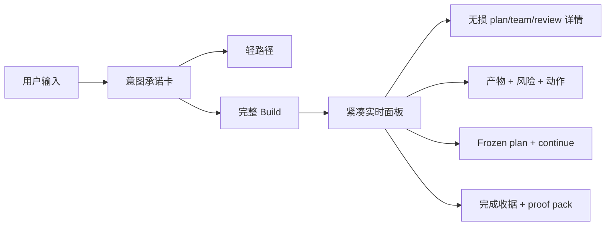

# UMADEV 产品 / 交互研究

- Benchmark: https://github.com/umacloud/umadev @ `b7484379db8ef7fa1881c84e7e9252c85c60061c` (`v1.0.71`)
- Date: 2026-07-31
- Confidence: high for state transitions and rendered information hierarchy; medium for actual interaction feel because no TUI session was run

## 速答

UMADEV 的产品优势不是“终端更酷”，而是把一次长 Agent 运行压缩成持续可理解、可纠偏、可恢复的操作面：

- 开工前先显示意图、深度、预算和实际召集角色，用户知道系统准备做多重。
- 运行中固定保留当前 step、完成比例、真实 roster 和最新 blocker；完整详情仍能无损查看。
- Gate 是产物审阅工作台，展示文件、风险、证据、修订动作，不只是一个“批准”按钮。
- 用户在运行中输入时，当前纠偏、只读问题、未来任务走不同车道，避免一句“为什么”被误当批准或返工。
- 暂停、恢复、完成都保留明确收据，不把沉默、截断或评审不可用包装成完成。

## 关键证据与可借鉴模式

### 1. 执行前显示“意图承诺卡”

- `crates/umadev-tui/src/app.rs:7939-7992`。
- 卡片展示 route class、depth、预估 tool calls、实际团队和选择理由。
- 借鉴价值：AINP 可在 request 被认领、run 尚未真正执行时展示 router 的最终 brief，而不是只显示“准备运行”。

### 2. 任务深度同时裁剪运行时和产品信息密度

- `docs/USER_GUIDE.md:124-161`。
- Chat/Explain 只读；QuickEdit/Fast Debug 走单写者 + 定向验证；Build/Standard/Deep Debug 才展开 Director。
- 借鉴价值：AINP 已有 ask/fastforward/standard，但详情页仍可进一步按路径隐藏无关面板，避免轻任务承受完整平台噪声。

### 3. Plan 使用“紧凑实时面板 + 无损详情”两层

- `crates/umadev-tui/src/ui.rs:3510-3747`：固定区显示 active step、done/total、roster、最新 review；空间不足时裁剪并给出完整入口。
- `crates/umadev-tui/src/app/plan_view.rs:15-200`：`/plan` 展开完整步骤、团队、评审和排队输入。
- 借鉴价值：AINP 可用顶部 run strip 呈现当前 Graph node 和 blocker，用现有详情区承载全量证据。

### 4. 计划 UI 与计划生效状态严格区分

- `crates/umadev-tui/src/app.rs:14368-14376`。
- `crates/umadev-agent/src/director_loop.rs:3098-3115`。
- `/plan skip|veto|up|down|add` 是 advisory directive，等下一边界被 Director 吸收并重发计划；不是直接改 DAG。
- 借鉴价值：AINP 若允许跳过/重排，要区分“变更已提交”“计划已采纳”“新 graph version 已生效”，不能让按钮制造假成功。

### 5. 运行中输入分三条车道

- `crates/umadev-agent/src/interaction.rs:60-99`。
- `crates/umadev-tui/src/app.rs:10529-10561`。
- `crates/umadev-tui/src/lib.rs:3311-3346`。
- 当前任务明确纠偏进入 steer；问题和未来任务进入 deferred FIFO；gate 上问“为什么”由只读会话回答。
- 借鉴价值：AINP 的 request chat 可增加显式 `steer / question / next-task` 语义，避免聊天消息隐式改变运行。

### 6. Gate 是产物审阅工作台

- `crates/umadev-tui/src/app.rs:8480-8623,17835-17939`。
- 卡片列出待审文件、缺失/过短/scaffold 风险、review checklist，以及继续、修订、diff 等动作。
- 借鉴价值：AINP 已有 artifact、GateRun、Approval 和 verifier matrix，最小改进是把 rule message、证据和建议动作放到批准按钮同一视野。

### 7. 团队展示坚持 anti-theater

- `crates/umadev-tui/src/app.rs:8130-8257,14490-14517`。
- roster 只显示实际拥有 plan step 的席位；最新 review round 和历史 handoff 分层展示。
- 借鉴价值：AINP 不应显示固定“多 Agent 团队”；只展示真实 HandoffRecord / AgentSession / Graph node owner。

### 8. 暂停与恢复是显式状态，不是笼统 Failed

- `crates/umadev-tui/src/app/frozen_plan.rs:27-110`。
- `crates/umadev-tui/src/app/run_pause.rs:6-75`。
- `crates/umadev-tui/src/app.rs:12823-12876`。
- 可恢复时从磁盘重建 frozen plan，active step 变成静态 paused；continue 只跑剩余步骤。
- 借鉴价值：AINP 已有 operational pause，可进一步在 Graph UI 中保留已完成 node、当前 resume cursor 与不会重跑的范围。

### 9. 恢复点操作本身也留下恢复点

- `crates/umadev-tui/src/app.rs:14270-14333`。
- `/rewind` 前先为当前状态建 checkpoint，并在 writer 活跃时拒绝恢复。
- 借鉴价值：AINP 可评估 node-boundary checkpoint 的 operator 恢复点，但 UI 必须明确它不是自动 git revert。

### 10. 完成态是一张运行收据

- `crates/umadev-tui/src/app.rs:15552-15662,8634-8709`。
- 收据包含每步最终状态、blocked/incomplete 数、changed files、关键入口、启动命令、proof pack 和 scorecard。
- 借鉴价值：AINP 已有 Completion Report，可把顶部完成态提炼成稳定的 artifact manifest，而不是让用户在证据面板里自行拼结论。

### 11. 状态栏只保留最可信、最有行动价值的信息

- `crates/umadev-tui/src/ui.rs:7086-7168,4765-4806`。
- 窄屏优先保留 backend、trust tier 和当前状态；token/cost 区分 exact、lower bound、unknown。
- 借鉴价值：AINP 的任务 hero 可优先显示当前 node、阻塞动作、backend 和证据状态，把技术 ID 与详细计量继续折叠。

## 对 AINP 的产品落点

1. 用现有 Graph Runtime 做顶部 live run strip，不新建第二份 execution-plan artifact。
2. Gate 主操作区直接显示首要 blocker、原始 rule message、evidence 和 remediation。
3. 团队面只消费真实 Handoff / AgentSession / node owner，拒绝装饰性 roster。
4. Running request chat 明确区分纠偏、只读问题和下一任务。
5. Paused / resumed / completed 都显示 node 级运行收据。

## 限制与未验证项

- UMADEV 仓库没有当前 TUI 的可信截图或录屏；`docs/GROK_BUILD_SOURCE_CONTRACT.md:866-869` 仍把 graphical/manual TUI matrix 标为 Pending。
- 因此这里只确认源码信息架构、状态转换和窄屏裁剪，未确认真实键盘手感、长日志下的可读性或五底座 rate-limit 恢复体验。
- `CapabilityPolicy` 的细粒度 read/write/shell/network 定义未发现生产调用点，不能当作已落地产品能力。
- 路线图中的 recovery action card 未找到渲染/处理调用，不能作为当前事实。
